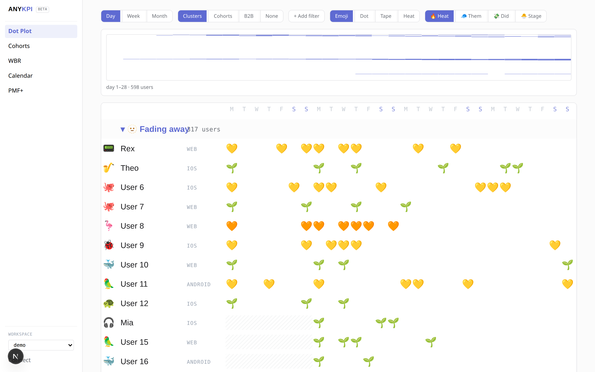
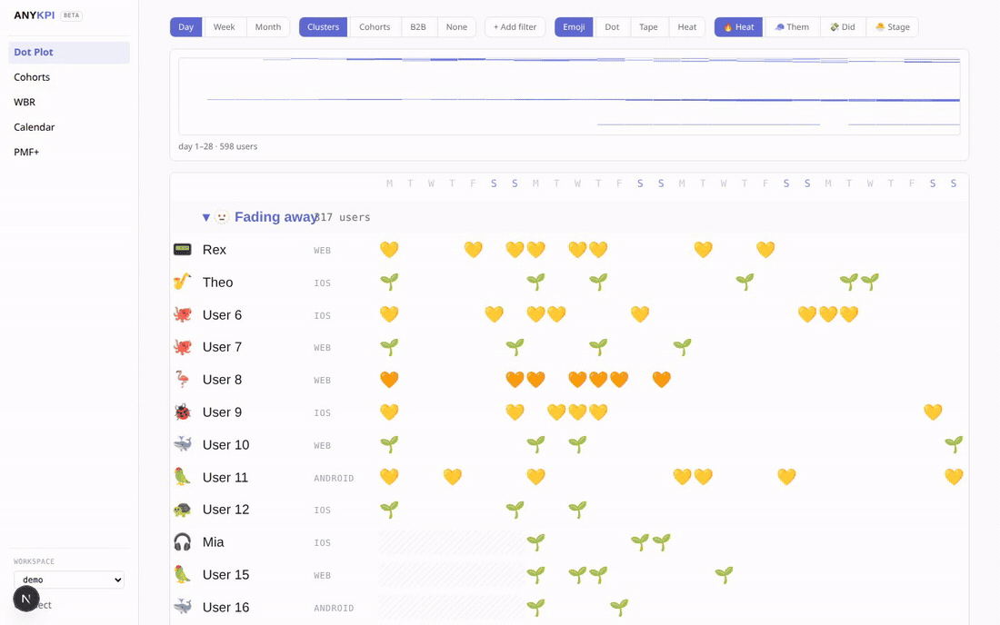

# ANYKPI

**The growth stack for modern builders.**

Self-hosted dashboard + REST API + CLI + MCP. Connect your tools or add ANYKPI to your product. Same resources humans see in the dashboard, agents can fetch via API.

Founder metrics: users, retention, PMF signals, WBR.




## What It Is

ANYKPI is an open-source dashboard. The only step is connecting data.

### Two On-Ramps (both agent-installable)

**Path 1: Connect existing tools**  
Shipped: PostHog, Mixpanel, Amplitude, Stripe, RevenueCat, Mercury, ICS, GitHub (`src/connectors/`). ANYKPI syncs summaries into local read models and never writes back. An agent can do this unattended. Calendar ICS is read-only forever.

**Path 2: Add ANYKPI events to your product**  
Don't have PostHog/Mixpanel/Amplitude? Add the ANYKPI SDK. Same step, human or agent. Events land in the same read models the connectors write. Self-hosted, person-level data never leaves your machine.

Both paths are first-class.

## Five Views

1. **Dot Plot** — Every user, every day. Streaks and silences read instantly.
2. **Cohorts** — Retention curves with smile detection (PMF signal).
3. **Weekly Business Review** — 6 weeks, 12 months, exceptions auto-surfaced.
4. **Calendar** — Read-only. Synced from connected tools.
5. **PMF+** — Research users, draft outreach (queued, never auto-sent).

Every view has a shareable URL.



Recapture the stills and GIF from the seeded `demo` workspace with `pnpm readme:assets`. Steps live next to the files in [docs/assets](docs/assets/README.md).

## Install

```bash
git clone https://github.com/dillon-wyrld/anykpi.git
cd anykpi
pnpm install
pnpm db:init
pnpm dev
```

The demo workspace loads automatically (public-read, fictional people). Set `ANYKPI_API_KEY` before connecting live data or deploying.

Start with the [self-host quickstart](#install).

Hosted version: join the [waitlist](https://github.com/dillon-wyrld/anykpi/discussions).

## Platform

- **Dashboard** at `/dashboard` — Five views with shareable URLs
- **REST API** at `/api/v1/*` — [OpenAPI reference](docs/introduction.md#rest-api)
- **CLI** via `npx @anykpi/cli` — [Install guide](docs/introduction.md#cli)
- **MCP** at `/api/mcp` — [Agent setup](docs/introduction.md#mcp)
- **Docs** at [docs/introduction.md](docs/introduction.md)

## Connect Data

Visit `/connect` to attach PostHog, Mixpanel, or Amplitude, ingest events with the SDK / CLI, or push a signed webhook (`POST /api/ingest/webhook/:source` — [recipes](docs/webhooks.md)):

```bash
anykpi login --url http://localhost:3000
anykpi identify user123 --name="Jane Doe"
anykpi track user123 song_played
```

[Full connect guide →](docs/introduction.md#the-one-step-connect-data)

## Agent Setup

ANYKPI is agent-native from day zero. Give your AI agent access via MCP:

1. Set `ANYKPI_API_KEY` and mint an additional key at `/connect` (or send the env key as `Authorization: Bearer`)
2. Add to your agent's MCP configuration:

```json
{
  "mcpServers": {
    "anykpi": {
      "url": "http://localhost:3000/api/mcp",
      "apiKey": "ak_..."
    }
  }
}
```

3. The agent can now:
   - Query users (`query_users platform=ios country=FR`)
   - Get cohorts (`get_cohorts`)
   - Check WBR metrics (`get_wbr`)
   - Get calendar events (`get_calendar`)
   - Connect a source, trigger sync, or import CSV (`connect_source`,
     `trigger_sync`, `import_csv` — write-scoped key)

Every response includes a `view_url` that opens the dashboard in the state that proves the answer.

### Agent Can Install ANYKPI

Give your agent this prompt:

```
Install the ANYKPI SDK in my app. Configure "song_played" as the core value event. 
Verify first events arrive.
```

The agent can do this unattended via MCP tools.

## Stack

- **Next.js 15** — App Router, TypeScript strict mode
- **SQLite + Drizzle** — Fast local read models via `DATABASE_PATH` ([Postgres later](docs/introduction.md#postgres-later))
- **Tailwind + shadcn** — Linear-light aesthetic
- **Hand-rolled SVG charts** — Seven rounds of prototype learnings baked in
- **MCP** — Streamable HTTP at `/api/mcp`

## Production Deploy

### Docker

```bash
docker run -p 3000:3000 \
  -e ANYKPI_API_KEY=your-secret \
  -v anykpi-data:/data \
  ghcr.io/dillon-wyrld/anykpi
```

`-p 3000:3000` publishes the dashboard; `-v anykpi-data:/data` persists SQLite. Omit the volume for an ephemeral demo. Images are tagged `latest` and the release version (`linux/amd64`, `linux/arm64`). To build locally instead: `docker build -t anykpi .` and run the same flags against `anykpi`.

`docker compose up` pulls the same image and keeps SQLite in the named volume `anykpi-data`.

### Railway (always-on)

[](https://railway.com/new?template=https://github.com/dillon-wyrld/anykpi)

Stays awake (`sleepApplication = false`) with a persistent volume at `/data`. Set `ANYKPI_API_KEY` before connecting live data.

`view_url` values use the request `Host` / `X-Forwarded-*` origin. Set `PUBLIC_BASE_URL` only if you need to pin them.

In production, if `ANYKPI_API_KEY` is unset, writes and non-demo reads are refused (503). Copy `.env.example` and see [SECURITY.md](SECURITY.md).

Data lives in the SQLite file at `DATABASE_PATH` (default `./data/anykpi.db`, or `/data/anykpi.db` in Docker). Back it up with `anykpi export` or a SQLite snapshot — [backup guide](docs/backup.md). It's yours. WBR exception thresholds live in `anykpi.config.json` beside that file (defaults in `anykpi.config.example.json`).

## Design Principles (binding)

- **Calendar is read-only forever.** No event editor, no manual entry.
- **No self-narrating chrome.** The answer is the view. No summary strips, no suggestion chips.
- **Motion is one-shot and earned.** No glows, no looping animation, no shadows on data marks.
- **Demo data ships forever.** A stranger never meets an empty screen.
- **Nothing sends on its own.** PMF+ outreach waits for approval.
- **No telemetry.** Person-level data never leaves the machine.

## Why It Wins

- **People, not averages** — The flagship view is named humans on a grid
- **Agent-native from day zero** — Agents aren't bolted on; they're first-class
- **Your data stays yours** — Self-hosted, no telemetry, ever. `anykpi export` writes your users, events, and read models. [Backup guide](docs/backup.md).
- **It teaches the method** — Choose "opened the app" as your value event and it warns you that's vanity
- **Your agent sets it up** — You don't instrument by hand
- **It's genuinely fun** — Stickers, emoji, confetti, without costing legibility

## Roadmap

- [x] Core dashboard on demo data
- [x] PostHog, Mixpanel, Amplitude connectors
- [x] Stripe connector
- [x] RevenueCat connector
- [x] ICS calendar sync (read-only)
- [x] ANYKPI SDK for direct event ingestion
- [x] MCP server for agents
- [x] Mercury connector
- [x] GitHub releases
- [ ] Milestone detector (1000th signup, company birthday, streaks)
- [ ] Semantic user clustering
- [x] PMF+ web research

## Contributing

MIT licensed. PRs welcome.

Self-hosted is free forever.

---

Built with ❤️ for founders who want to see their people.
